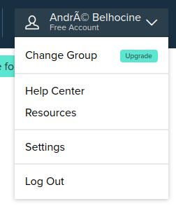
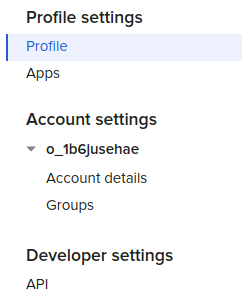
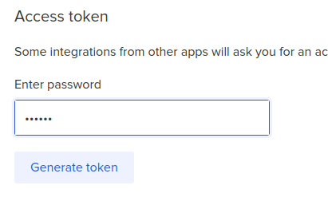

# **Coding Challenge** 🦅

# What you have to do

_“As a user I want to shorten my long url and be able to copy it into clipboard to post it on a social platform (e.g. Twitter).”_

## Challenge

In this challenge, we’re asking you to create a user interface to shorten URLs so,

If you are a **front end developer**,  please use the [Bitly API](https://dev.bitly.com/api-reference#operation/createBitlink) for the backend part.
To get a token you can follow these steps:

Go to your user settings

Select API in the menu

After filling your user password you can request a token

In order to use the bitly API you need an `Authentication token`, which you will put in the environment variables (`.env`) of the project.

[Adding a custom environment variables](https://create-react-app.dev/docs/adding-custom-environment-variables/)

If you are a **full stack developer**, please tackle both backend and frontend part of the challenge, each of course only to the extent possible within the given time frame.

Bonus points:

-   `Validate user data`
-   `Create a test suite`
-   `Create and use reusable components`
-   `Create your own CSS theme (clean & responsive layout)`

Please do not spend more than **2 hours** on this, don’t worry if you don’t finish everything. Please send us a link to your project on GitHub. Good luck and have fun!

### Installation & setup

Run `yarn install` to install dependancies, then copy `.env.dist` to `.env`.

### Available Scripts

In the project directory, you can run:

#### `yarn start`

Runs the app in the development mode.
Open [http://localhost:3000](http://localhost:3000) to view it in the browser.

The page will reload if you make edits.
You will also see any lint errors in the console.

#### `yarn lint`

Check and fix based on linting rules

### `gitclone git@github.com:ScottyZA/backendend-challenge.git`

Clone FastAPI backend in another directory and run docker-compose for backend services.

Instructions found in the README.md file.
